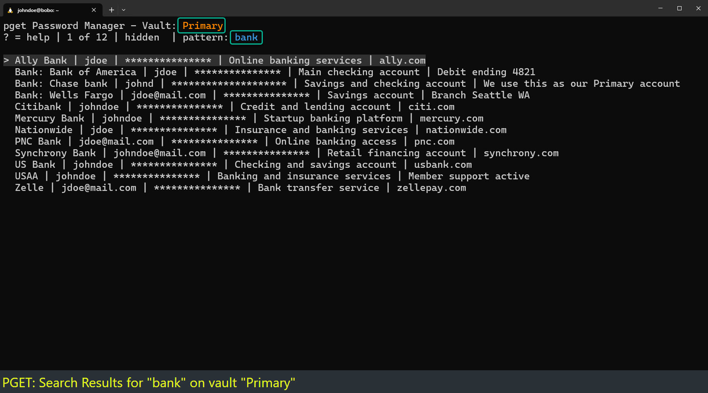

# pget - Password Management tool

pget is a feature rich interactive Linux CLI bash based Password Management tool using GPG-(AES256) backed encryption.<p>
<br>
<a href=./gallery><font size=4>View Gallery</font></a>

---
## Security Model Overview
The following is a security-focused comparison between pget and a typical cloud-based password management tools. 
<br>Read the full <a href=./SECRURITY_REVIEW.md>SECURITY REVIEW</a>. 

| Security Area | pget | Cloud Password Manager |
| --- | --- | --- |
| Data location | 🟢 Local encrypted vault only | 🔴 Remote cloud vault |
| Network exposure | 🟢 None required | 🔴 Internet-connected service |
| Server breach risk | 🟢 No central server to breach | 🔴 Vendor infrastructure can be targeted |
| Vendor trust | 🟢 No vendor required | 🟡 Must trust provider and platform |
| Encryption model | 🟢 GPG symmetric encryption | 🟢 Vendor-managed strong encryption |
| Offline use | 🟢 Fully offline | 🟡 Often limited or cached |
| Account takeover risk | 🟢 No online account | 🔴 Online account can be attacked |

---
## Features

* FULL Vault Lifecycle Management
  - Vault Manager
  - Multi-vault support
  - Structured Entry management 
  - Automated Backup system with auto-retention
* Full screen UI engine
* Interactive Search Engine (single or multiple pattern queries supported)
* Clipboard integration (OSC52/SSH-safe) over remote sessions
* Password generator support (pwgen, openssh, /dev/urandom)
* GPG AES256 Encryption / Decryption
* GPG TTY handling
* Supported Fields: Title, ID, Secret (support auto-generator), Comments
* Multi-vault support
* Interactive vault selector
* Detects decryption failures
* Hiddend Password Cursor 
* Dynamic window resizing
* WINCH signal handling
* On screen 
* Notification of Hidden / visible passwords
* List view format: Title | ID | ****** | Comments
* Secret masked unless visible
* Full entry viewing
* Structured display:
* Additional Display delimiters for COMMENTS (split by |)
* Enhanced navigation: arrows, j, k, Home, End, PageUp, PageDown
* Smart scrolling
* Mask (hidden) / unmask (open text) of passwords
* Ctrl-C protection
* Add Entry
* Modify Entry
* Delete Entry
* Interactive flow
* edit maste encryption file
* Interactive search
* On-demand Kill GPG agent (cache clearing)
* User variable control 
* Edge Case Handling

---

## INSTALLATION

There are 2 installations methods that can be used: Automated and Manual.

### Automated: The easiest method
Run the provided script in the pget directory:
```
$ ./setup_pget
```

Your done. Scroll down to testing and launching.

### Manual: 5 simple steps

**1.  Install the prerequisites:**

*Note: pwgen (password generator) is optional. Two other methods can be used to generate a password in pget: openssl, and urandom. It is set ($PWGEN) in the main pget script.*

Debian (ubuntu, Linux Mint, Kali, ...):
```
	$ sudo apt install vim vim-runtime gnupg pwgen
```

Fedora (RedHat, AlmaLinux, Rocky Linux, ...):
```
	$ sudo dnf install vim vim-enhanced gnupg pwgen
```

**2.  Go to the parent directory of pget:**
    
```
	$ cd /path/to/parent  
	$ ls pget/
```

**3.  Append the vimrc plugin configurations to ~/.vimrc:**
    
```
$ cat pget/vimrc.conf >> ~/.vimrc
```

    
**4.  Copy pget into /opt**
	If /opt does not exist, 
```
$ sudo mkdir -p /opt
```
    
```
$ sudo cp -r pget /opt/
```
    
**5.  Link path to executable***
    
```
$ sudo ln -s /opt/pget/pget /usr/local/bin/pget
```

That's it!

---

# Test Installation:
**1. Test vim encryption**
```
$ vim test.gpg
This is a test
:wq
```
   
You should be prompted for a passphrase.

**2. Verify AES256 encryption, and the file can be decrypted:**

To confirm it is AES256 encrypted:
   ```
$ gpg --list-packets test.gpg 2>&1 | grep 'encrypted data'
```

To confirm the file can be decrypted:
```
   $ gpg -d test.gpg
```

# Start pget
pget will go through a first time launch process.
```
   $ ./pget
```

