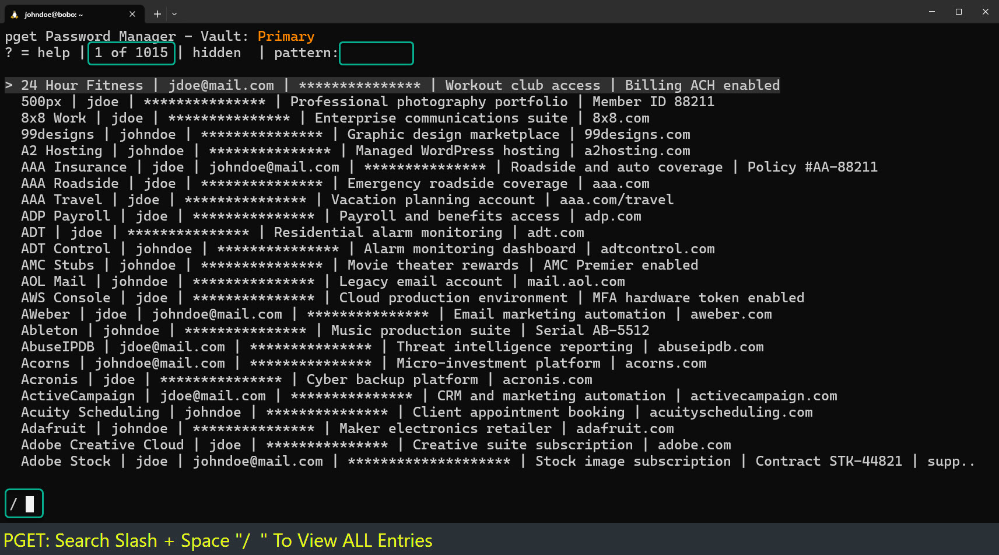
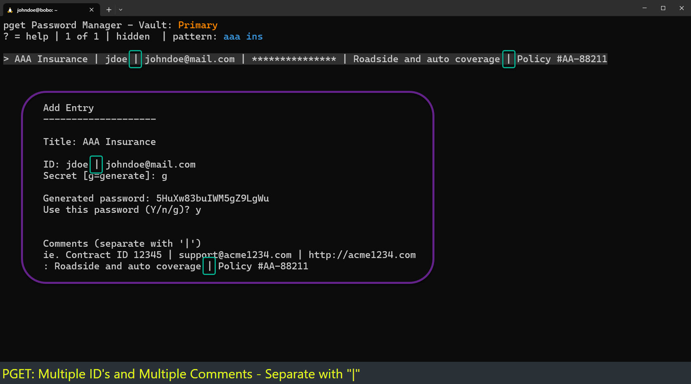
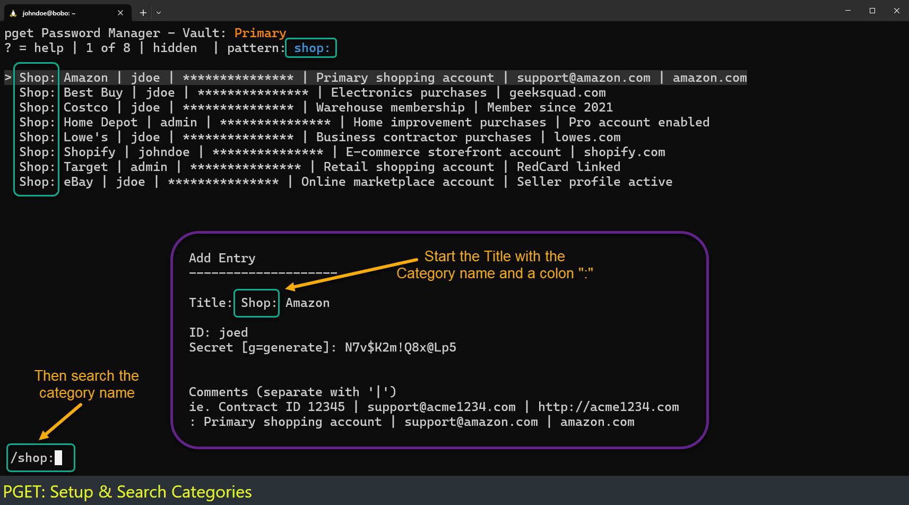

# TIPS for using pget

1. Think vim!
2. Searching Made Easy
3. Formatting Entries
---
### 1. Think vim!
Initially pget was vim based only. As the UI was developed
vim like keystrokes were used to quickly launch what is
needed most and quickly using just the right hand:
| Key | Action |
|-----|--------|
| j | Up |
| k | Down |
| h | Hide and unhide secrets/password | 
| l | Look/show more information on an entry |
| y | Yank to the clipboard |
| / | Slash to search |
| ? | Help Page |

---

### 2. Searching Made Easy

Command Line: Search the default vault for all entries with the pattern "bank":
```
$ pget bank
```
Command Line: Search the specific vault "Work" for the pattern "microsoft"
```
$ pget -v Work microsoft
```

User Interface: Use slash "/" by itself to the first 40 entries

User Interface: Use slash + Space "/ " to view ALL entries in the vault.



---

### 3. Formating
The format of a vault file is 4 fields separated by tabs:
```
Title [tab] ID [tab] SECRET [tab] Comment
```

Here are some formatting tips to make searching easier:

**Multiple ID's and Comments**: Use verticle bars "|" as a separator for multiple ID's and Comments:



**Categories:** Use Categories before the title to group searches together<br>
&nbsp;&nbsp;&nbsp;&nbsp;**Category: Title** <p>

&nbsp;&nbsp;&nbsp;&nbsp;Shop: Amazon <br>
&nbsp;&nbsp;&nbsp;&nbsp;Shop: Best Buy<br>
&nbsp;&nbsp;&nbsp;&nbsp;Shop: Costco <br>



